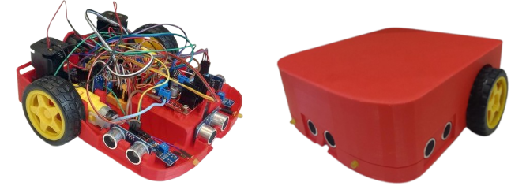
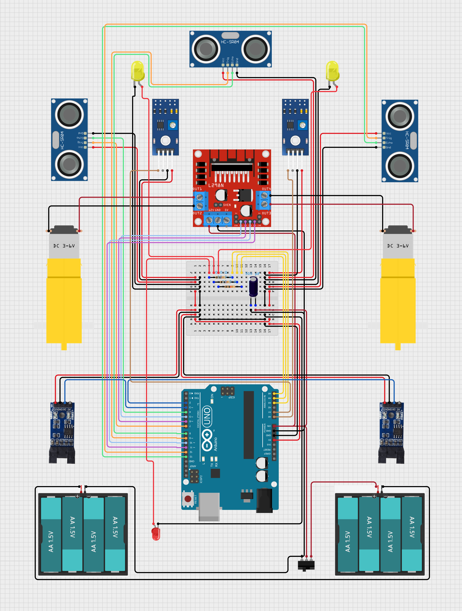

# AR2R4

El AR2R4 es un robot educativo de diseño abierto basado en
la placa Arduino UNO R4, orientado específicamente a la
enseñanza progresiva de programación y robótica móvil.
El robot fue concebido con el objetivo de ofrecer una
plataforma de muy bajo costo (se estima que el costo total es
USD 120, a precios de mayo de 2026), fácilmente reproducible
mediante impresión 3D y componentes comerciales accesibles,
pero al mismo tiempo suficientemente flexible como para cu-
brir distintos niveles de complejidad educativa y tecnológica.

